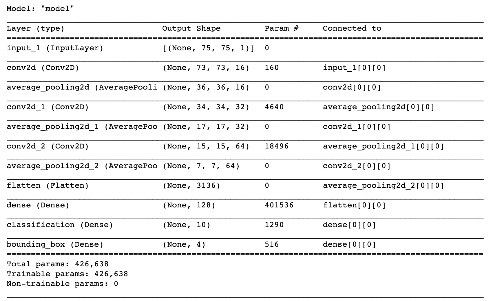
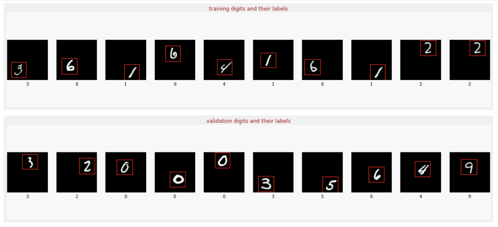
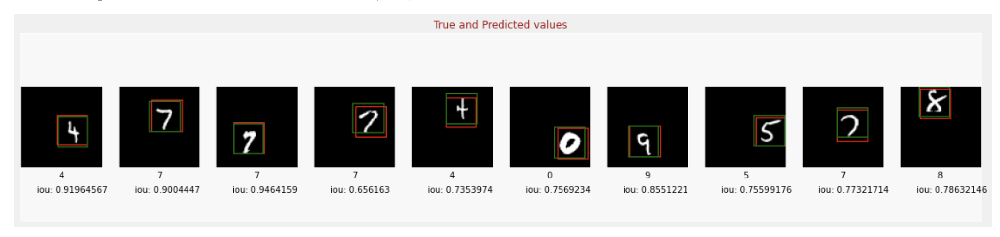

# Classification and object localization of the handwritten digits

## Table of Contents
* [General Info](#general-information)
* [Results](Results)
* [Technologies Used](#technologies-used)
* [Contact](#contact)
<!-- * [License](#license) -->

## General Information
- The project has two goals: 1) first to classifiy the handwritten digit 2) predict the bounding box around the hand-written digit
- I am using a branched neural network architecture using TensorFlow functional API: 
  - 1) feature_extractor: these convolutional layers extract the features of the image.
  - 2) classifier: This define the output layer that predicts among 10 categories (digits 0 through 9)
  - 3) bounding_box_regression: This defines the output layer that predicts 4 numeric values, which define the coordinates of the bounding box (xmin, ymin, xmax, ymax)
  

- The link to the dataset: [Handwritten digits dataset](http://yann.lecun.com/exdb/mnist/).

- The model achieves an accuracy of 99% for the classification and MSE of 0.0012 for the regression on the validation set after 10 epochs.
- I ran the notebook on Arizona State University's supercomputing cluster using two Tesla V100 GPUs.

## Results

<!-- If you have screenshots you'd like to share, include them here. -->

## Technologies Used
- Python
- Tensorflow
- Pandas
- Matplotlib
- Keras

## Contact
Created by [Miralireza Nabavi](anabavib@asu.edu) - feel free to contact me!
